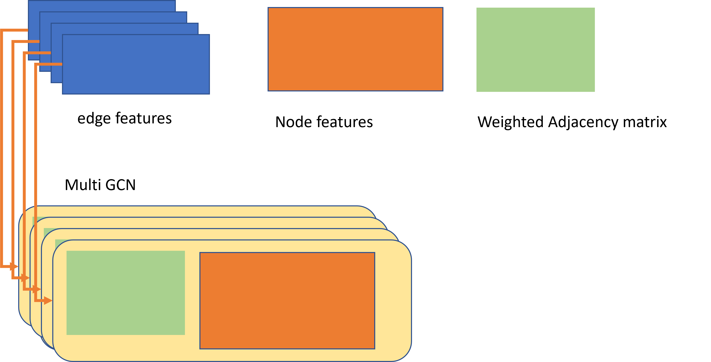

# Graph (multi-dimention edge, node) Classification Task on HIV dataset

## Table of Contents 

- Usage and Option
- Dataset
- Model types
- Experiment results

## Usage 
```
# 
python train.py --gnn gcn 
(python train.py --dataset $DATASET --gnn $GNN_TYPE --filename $FILENAME)

python evaluate.py --filename ./models/gcn_2.pt
(python evaluate.py --dataset ogbg-molhiv --filename ./models/gcn_2.pt)
```

### `$DATASET`
`$DATASET` specified the name of the molecule dataset. It should be one of the followings:
- `ogbg-molhiv`


### `$GNN_TYPE`
`$GNN_TYPE` specified the GNN architecture. It should be one of the followings:
- `gin`: GIN [2]
- `gin-virtual`: GIN over graphs augmented with virtual nodes\* [4]

- `gcn`: GCN [3]
- `gcn-virtual`: GCN over graphs augmented with virtual nodes\* [4]

- `gcn-pyg`
- `gat-pyg`
- `transformerconv`
    

\* Additional nodes that are connected to all the nodes in the original graphs.

### `$FILENAME`: Specifying output file. 
`$FILENAME` specifies the filename to save the result. The result is a dictionary containing (1) best training performance (`'BestTrain'`), (2) best validation performance (`'Val'`), (3) test performance at the best validation epoch (`'Test'`), and (4) training performance at the best validation epoch (`'Train'`).


## Dataset 

- ogbg-molhiv

(in moduleNet[1])
``` 
The HIV dataset was introduced by the Drug
Therapeutics Program (DTP) AIDS Antiviral Screen, which
tested the ability to inhibit HIV replication for over 40 000
compounds.47 Screening results were evaluated and placed into
three categories: conrmed inactive (CI), conrmed active (CA)
and conrmed moderately active (CM). We further combine the
latter two labels, making it a classication task between inactive
(CI) and active (CA and CM). As we are more interested in
discover new categories of HIV inhibitors, scaffold splitting
(introduce
```

## model types

- '-pyg'
It handles one-dimension edge features.
e.g., GCNConv(in torch geometric) handles only one dimension edge (as a edge weights).
To solve the multi-dimension problem, we have to use multi-parallel-model,



- w/o 'pyg'
It handles multi-dimension edge features.

## Experiment results

| model           | rocauc |
|-----------------|--------|
| gat-pyg         | 75.87  |
| gatv2           | 74.49  |
| gcn             | 74.09  |
| gcn-pyg         | 74.45  |
| gin             | 71.08  |
| TAG-pyg         | 72.71  |
| transformerconv | 72.42  |


## References
[1] Wu, Z., Ramsundar, B., Feinberg, E. N., Gomes, J., Geniesse, C., Pappu, A. S., ... & Pande, V. (2018). MoleculeNet: a benchmark for molecular machine learning. Chemical science, 9(2), 513-530.

[2] Xu, K., Hu, W., Leskovec, J., & Jegelka, S. (2019). How powerful are graph neural networks?. ICLR 2019

[3] Kipf, T. N., & Welling, M. (2017). Semi-supervised classification with graph convolutional networks. ICLR 2017

[4] Gilmer, J., Schoenholz, S. S., Riley, P. F., Vinyals, O., & Dahl, G. E. Neural message passing for quantum chemistry. ICML 2017.
